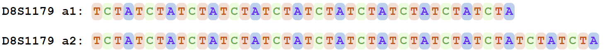
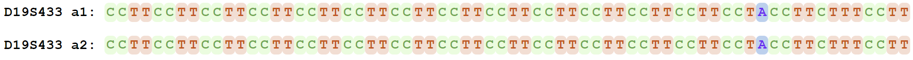

# StrPhaser
A novel bioinformatics software to build STR alleles and phase them using VCF and reference sequence.

Works for any computing system where the Java Run environment is available. The tested systems include:

Windows 10,11

Mac OS 11.6.5

Linux: Ubuntu 20.04, 22.04; Center OS 8

## Installation 
The software can be downloaded for a direct use. No additional compiling and installation.  Get it from Github by type the following command in a terminal window: 

`git clone https://github.com/XuewenWangUGA/StrPhaser`

or download the zip compressed files and then unzip to StrPhaser

remove the version number: change the file name of StrPhaserv###.jar , e.g., StrPhaserv1.0.jar to StrPhaser.jar

## Update Java run environment if necessary
The sfotware will use the Java runtime environment (SE) V17. If your computer has an old version of Java runtime, please install the newest Java or Java SE Development Kit 17 or higher from https://www.oracle.com/java/technologies/downloads/. Either Java or Java SE should work.

## The latest version 
v1.0

## License
The tool is under the Lesser General Public License v2.1. Free to distribute and improve. Free for all academic and educational purposes. A license is needed to be obtained from us for any industrial and any other purposes. Please contact us.

## Usage:
Open a terminal window and type the following command: 

`java -jar StrPhaser.jar [options]  >out.tsv`

or if want to control the maxi allowed computing memory, add -Xmx option:e.g., the -Xmx4G is for the allowed maximum 4G memory to use,  or changed to any memory you needed, e.g., 2G: -Xmx2G

`java -jar -Xmx4G StrPhaser.jar [options]  >out.tsv`

Options:  
      
      -r,--referenceSeq <arg>      reference genome sequence file in fasta format, accompanied by an indexed .fai from samtools faidx: eg. hg38.fasta, hg38.fa.fai  
     -s,--strRegion <arg>         STR regions in tabular plain text, 1-based coordinate, one locus per line.  
                                  eg.  Chrom ChromStartPos_Str ChromEndPos_Str Name
                                       chr1 1000 10100 mkName1
                                       chr3 3000 30200 mkName2
    -t,--ThreadNumber <arg>      integer, the number of computing threads, default [1]
    -v,--vcf <arg>               vcf file in .gz and with index gz.tbi from bcftools index --tbi

       
## Examplar analysis step by step
Here is an example of how to use this tool for a human for 8-kb regions of 20 CODIS core STR sites.  For your specific genome, you just need to replace the genome and targeted sites in configure files with yours.
Firstly go to the software directory in the command window:

` cd StrPhaser`
       
### Step 1. prepare a genome reference file which should be the one used for vcf generation previously 
Download the genome sequence of human from the 1000 Genome Project to the folder "StrPhaser" 
       ftp://ftp.1000genomes.ebi.ac.uk/vol1/ftp/technical/reference/GRCh38_reference_genome/GRCh38_full_analysis_set_plus_decoy_hla.fa	
or use the command: 

       `wget ftp://ftp.1000genomes.ebi.ac.uk/vol1/ftp/technical/reference/GRCh38_reference_genome/GRCh38_full_analysis_set_plus_decoy_hla.fa`

Then to index the genome sequence with samtools (tool link: https://www.htslib.org/)  

       `samtools faidx GRCh38_full_analysis_set_plus_decoy_hla.fa`
       
       
### Step 2. get test data and targeted site files 
Download the subdirectory `testData` from this page and put it inside the folder "StrPhaser".

### Step 3. run the analysis with the following command
We use the vcf files for human sample HG00130 as the test data. The original files are downloaded from the 1KG project at https://www.internationalgenome.org/data-portal/data-collection/30x-grch38. VCF for all chromosomes are merged and sorted, indexed with bcftools. To use the following command to run :

For Windows system:

`java -jar StrPhaser.jar -r GRCh38_full_analysis_set_plus_decoy_hla.fa -s testData\CODISSTR_anchor.XW.config_v0.3.txt -v testData\CCDG_14151_B01_GRM_WGS_2020-08-05_AllChr.filtered.shapeit2-duohmm-phased.8000.HG00130.vcf.gz -t 2 >out.tsv`

For Linux-like systems:
`java -jar StrPhaser.jar -r GRCh38_full_analysis_set_plus_decoy_hla.fa -s testData/CODISSTR_anchor.XW.config_v0.3.txt -v testData/CCDG_14151_B01_GRM_WGS_2020-08-05_AllChr.filtered.shapeit2-duohmm-phased.8000.HG00130.vcf.gz -t 2 >out.tsv`

Here the output will be saved to "out.tsv", which is a tab seperated plain text. You can give any file name as like. If no output file name is given, the output will be directed into standout/screen of the terminal window.

## output: 
### results 1. out.tsv

The output will look like:

   #input pars: -r GRCh38_full_analysis_set_plus_decoy_hla.fa -s testData/CODISSTR_anchor.XW.config_v0.3.txt -v testData/CCDG_14151_B01_GRM_WGS_2020-08-05_AllChr.filtered.shapeit2-duohmm-phased.8000.HG00130.vcf.gz -t 2 
#pars: -r GRCh38_full_analysis_set_plus_decoy_hla.fa -s testData/CODISSTR_anchor.XW.config_v0.3.txt -v testData/CCDG_14151_B01_GRM_WGS_2020-08-05_AllChr.filtered.shapeit2-duohmm-phased.8000.HG00130.vcf.gz -t 2
#	time: 2023-11-20 11:06:08.040935446
#Total loci in STR configure file:	20

#Marker	AlleleID	Length(bp)	Allele(stitched_and_phased)	CallType	Sample
CSF1PO	a1:	40	ATCTATCTATCTATCTATCTATCTATCTATCTATCTATCT	vcfcall
CSF1PO	a2:	44	ATCTATCTATCTATCTATCTATCTATCTATCTATCTATCTATCT	vcfcall
D10S1248	a1:	52	GGAAGGAAGGAAGGAAGGAAGGAAGGAAGGAAGGAAGGAAGGAAGGAAGGAA	vcfcall
D10S1248	a2:	64	GGAAGGAAGGAAGGAAGGAAGGAAGGAAGGAAGGAAGGAAGGAAGGAAGGAAGGAAGGAAGGAA	vcfcall
D12S391	a1:	76	AGATAGATAGATAGATAGATAGATAGATAGATAGATAGATAGATAGACAGACAGACAGACAGACAGACAGACAGAT	vcfcall
D12S391	a2:	76	AGATAGATAGATAGATAGATAGATAGATAGATAGATAGATAGATAGATAGACAGACAGACAGACAGACAGACAGAT	vcfcall

The # section is the comments.

In the output file, there will have many columns. for a diploid genome, there will be at least one allele. For polyploidy genome, there may have have more then one allele for each marker/locus. 

The "Marker" column contains the same name a locus or marker as given in configure file.

The "AlleleID" column is the name of phased alleles. a0 for a reference call, a1, and a2 for alternatice alleles different from reference genome sequence.

The "Length(bp)" column is the bp of bases.

The "Allele(stitched_and_phased)" is the allelic sequences of a STR.

The "CallType" has the information suggesting from reference seq (refcall) or vcf (vcfcall).

The "Sample" may have the information of the sample name inherited from vcf.

the file can be opened in Microsoft Excel or other spreadsheet for easy read.

### results 2. colorful alleles .html

Another result called output .html will be also generated for a colorful display of the alleles if supported by your system. It should be supported in most system but not all like outdated Centos with command support only. This file will be opened in an internet web browser by default if available.

 Fig.1 Colorful alleles of locus D8 output 

 Fig.1 Colorful alleles of locus D19 output 

## Citation

Coming soon

## Questions

Please post or contact me if you have any questions.

       

                              
